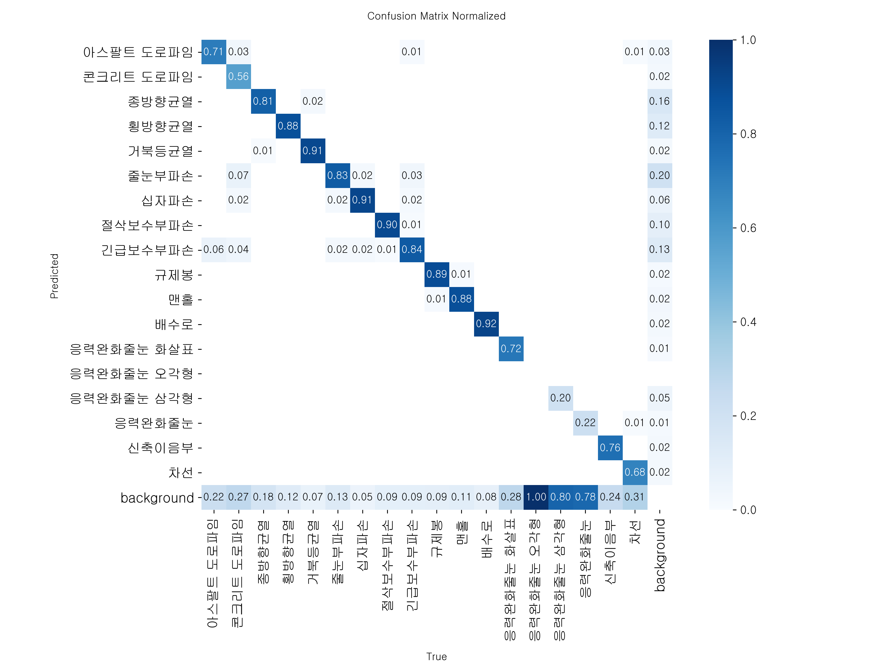
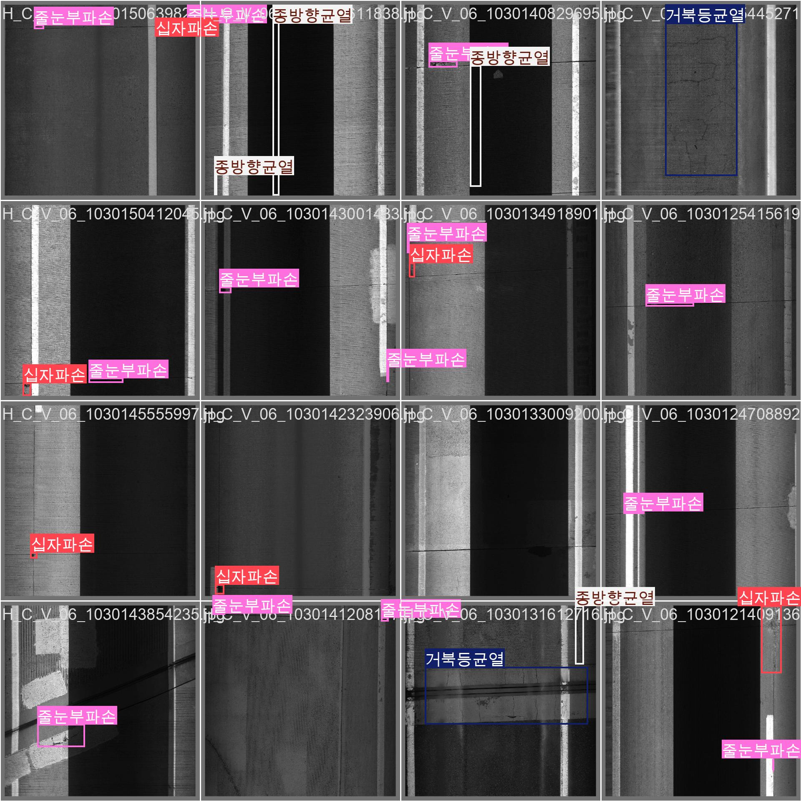
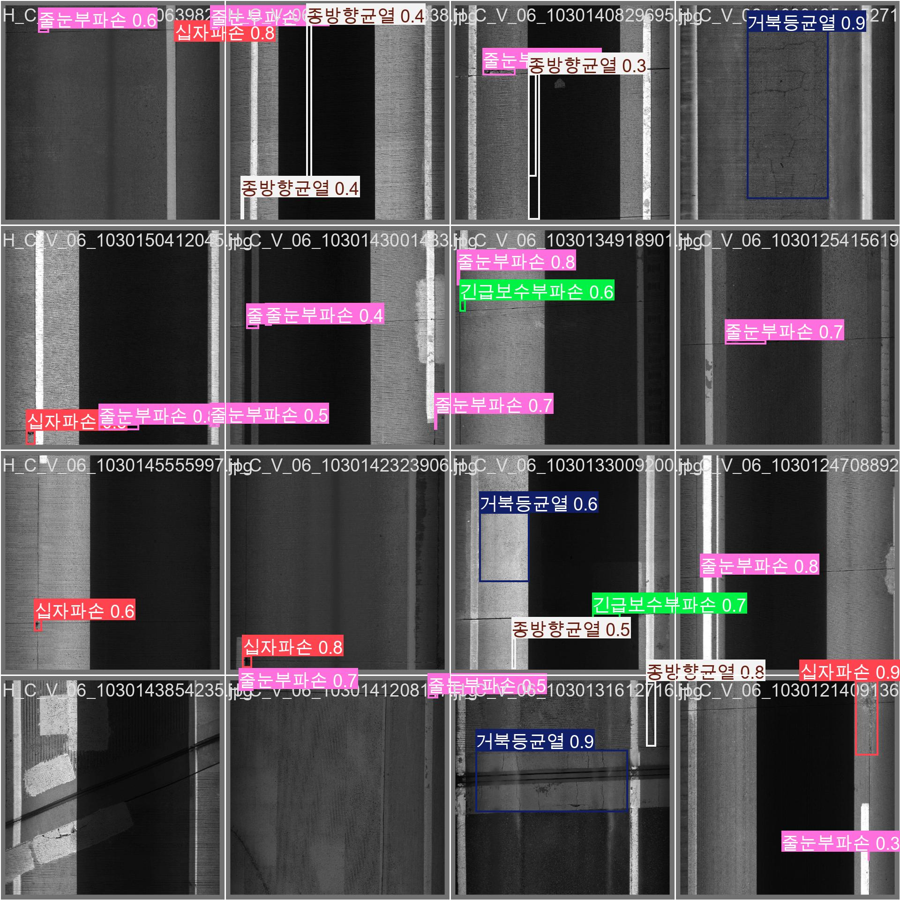
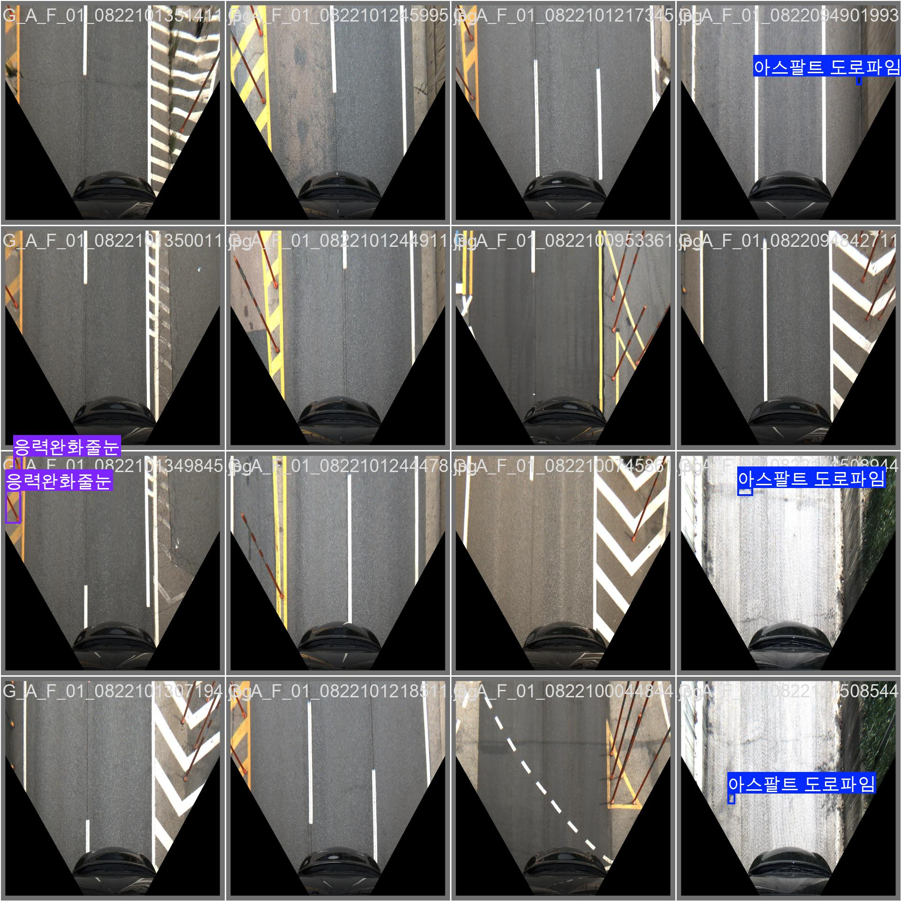
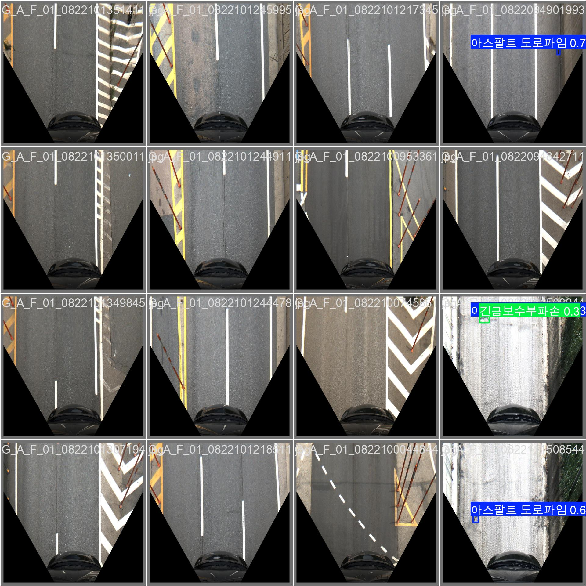
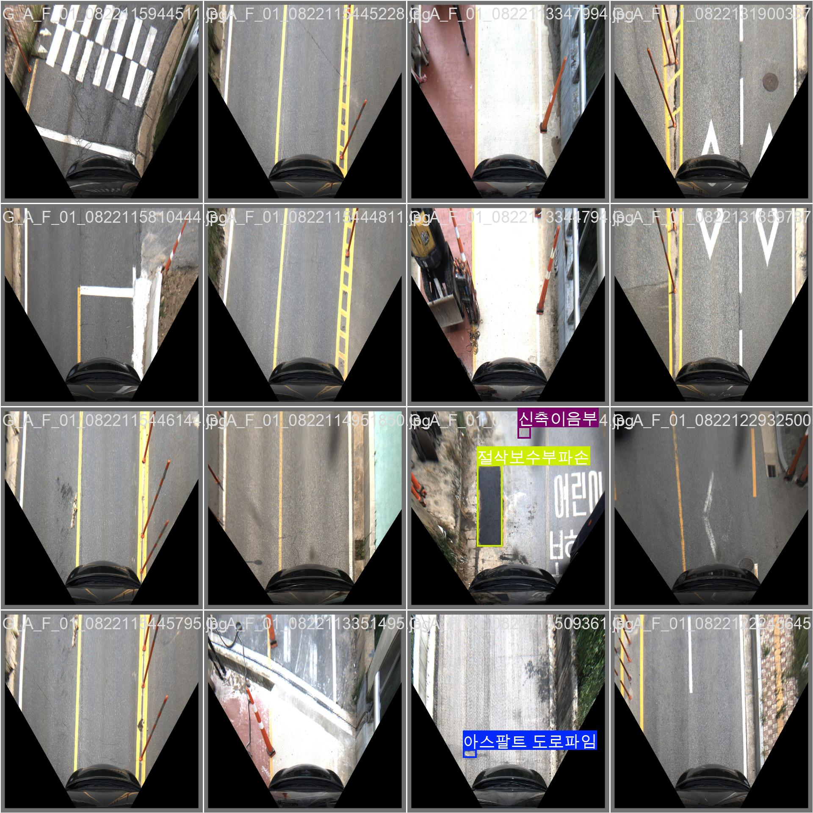
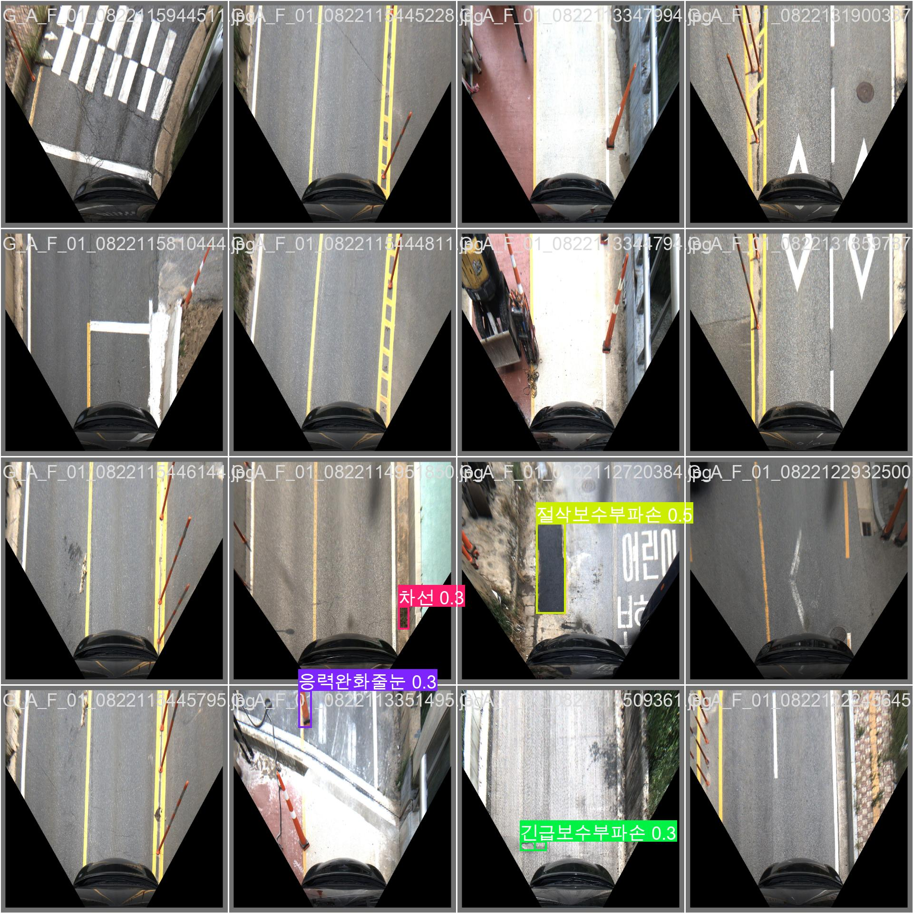

도로 상태 분석 (Road Condition Classification)
데모 버전 : https://huggingface.co/spaces/Spearoad/rcc
이 시스템은 두 가지의 모델로 구성되어 있습니다.
첫 번째로 분류 모델, 두 번째로 탐지 모델로
두 모델 모두 AIHub의 고해상도 도로노면 이미지 데이터를 활용하였습니다.
분류 모델은 EfficientNet-B3 모델을 사용했고, 탐지 모델은 YOLOv5m 모델을 사용하였습니다.
분류 모델은 도로의 파손 여부를 분류하고 정상 또는 파손됨으로 분류합니다.
이때 파손됨으로 분류되면 탐지 모델이 해당 사진을 이어받는데, 파손된 부분을 이미지에서 표시해서 보여줍니다.

탐지 모델의 혼동 행렬

탐지 모델 검증
| 실제 | 예측 |
|:---:|:---:|
|  |  |
|  |  |
|  |  |
